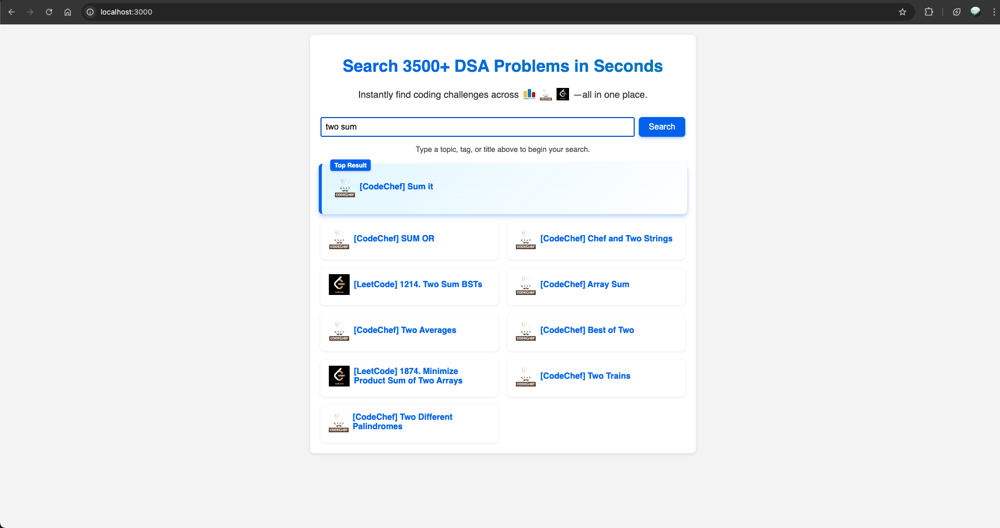

# DSA Search Engine

An **in-memory TF-IDF search tool** for Data Structures & Algorithms problems sourced from **LeetCode**, **Codeforces**, and **CodeChef**, built with **vanilla JavaScript**, **Node.js**, and **Express**—no external database required.

---



## 📌 Features

- **Unified Dataset**: Consolidate problem metadata from three platforms into `all_problems.json`.
- **Custom TF-IDF Engine**:
  - Tokenization, stop-word removal, stemming
  - Compute DF/IDF, per-document TF-IDF vectors
  - Cosine similarity ranking
- **Search API**:
  - **POST** `/search` accepts `{ query: string }`
  - Returns **top 10** results
- **Vanilla Frontend**:
  - Responsive HTML/CSS/JS
  - Card-based, two-column grid (desktop)/single-column (mobile)

---

## 🧰 Prerequisites

- **Node.js** v18+

---

## 🔧 Installation & Setup

1. **Clone the repo**

   ```bash
   git clone https://github.com/aaqib605/dsa-search-engine.git
   cd dsa-search-engine
   ```

2. **Install dependencies**

   ```bash
   npm install
   ```

3. **Merge problems from leetcode, codeforces, and codechef into single dataset**
   ```bash
   node merge.js
   # Generates all_problems.json
   ```

---

## ▶️ Running the Application

```bash
# Start the server (API + static files)
node src/index.js
```

- **Frontend** accessible at: `http://localhost:3000`

---

## ⚙️ How It Works

1. **Data Loading**: `tfidfIndex.js` loads `all_problems.json` into RAM.
2. **Preprocessing**:
   - Lowercase, strip non-alphanumerics
   - Tokenize by whitespace
   - Remove English stop-words
   - Stem via Porter Stemmer
3. **Index Building**:
   - Compute document frequency (DF) per term
   - Calculate inverse document frequency (IDF)
   - Build sparse TF-IDF vector for each problem
4. **Search Query**:
   - Preprocess user query identically
   - Compute query TF-IDF vector
   - Score all documents via cosine similarity
   - Return top 10 matches

---

## 📄 License

MIT © Aaqib Javaid
